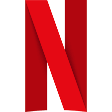

# Mianaflix - Netflix Clone



## 📱 Live Demo
[View Live Demo](https://vermillion-klepon-d6f4e9.netlify.app)

## ✨ Overview
Mianaflix is a full-featured Netflix clone built with React, Redux, and Firebase. It replicates the core functionality and UI of Netflix, including user authentication, movie browsing, searching, and trailer playback.

## 🔥 Features
- **User Authentication** - Complete signup, login, and profile management
- **Multiple User Profiles** - Support for multiple user profiles like Netflix
- **Movie & TV Show Browsing** - Dynamic content categorization
- **Responsive Design** - Mobile-friendly interface
- **Movie Trailers** - Watch trailers for any selected content
- **Global Content Filtering** - Filter all content by type
- **Search Functionality** - Find content by title, actor, or genre
- **My List** - Save favorite content to watch later
- **Continue Watching** - Resume watching from where you left off
- **Content Categories** - Browse by genre, popularity, trending, etc.
- **Netflix-Style UI** - Card sliders, hover effects, and animations

## 🛠️ Technologies Used
- React.js
- Redux Toolkit for state management
- Firebase Authentication
- Styled Components for styling
- Axios for API requests
- React Router for navigation
- TMDB API for movie data
- YouTube API for trailers
- Local Storage for persistent data

## 📥 Installation and Setup

### Prerequisites
- Node.js & npm
- Firebase account for authentication
- TMDB API key

### Installation Steps
1. Clone the repository
   ```bash
   git clone https://github.com/ZahidMiana/netflixclone.git
   cd netflixclone
   ```

2. Install dependencies
   ```bash
   npm install
   ```

3. Create a `.env` file in the root directory with your API keys:
   ```
   REACT_APP_TMDB_API_KEY=your_tmdb_api_key
   REACT_APP_FIREBASE_API_KEY=your_firebase_api_key
   REACT_APP_FIREBASE_AUTH_DOMAIN=your_auth_domain
   REACT_APP_FIREBASE_PROJECT_ID=your_project_id
   REACT_APP_FIREBASE_STORAGE_BUCKET=your_storage_bucket
   REACT_APP_FIREBASE_MESSAGING_SENDER_ID=your_messaging_sender_id
   REACT_APP_FIREBASE_APP_ID=your_app_id
   ```

4. Start the development server
   ```bash
   npm start
   ```

## 📂 Project Structure
```
src/
├── assets/             # Static assets (images, logos)
├── components/         # Reusable UI components
│   ├── Card.jsx        # Movie card component
│   ├── CardSlider.jsx  # Horizontal scrollable card container
│   ├── ContinueWatching.jsx # Continue watching row
│   ├── Footer.jsx      # Page footer
│   ├── Navbar.jsx      # Navigation bar
│   ├── Search.jsx      # Search functionality
│   └── UserProfile.jsx # User profile component
├── pages/              # Page components
│   ├── Login.jsx       # Login page
│   ├── Movies.jsx      # Movies page
│   ├── MyList.jsx      # Saved content page
│   ├── Netflix.jsx     # Home page
│   ├── Player.jsx      # Video player page
│   ├── SearchResults.jsx # Search results page
│   ├── Signup.jsx      # Signup page
│   └── TVShows.jsx     # TV Shows page
├── store/              # Redux store configuration
│   └── index.js        # Redux reducers and actions
├── utils/              # Utility functions
│   └── firebase-config.js # Firebase configuration
├── App.jsx             # Main app component
└── index.js            # Entry point
```

## 🚀 Usage
1. Sign up or log in to your account
2. Browse through different categories of movies and TV shows
3. Click on a movie to view its trailer
4. Use the global filter to filter content by type
5. Search for specific content using the search bar
6. Add movies to "My List" to watch later
7. Switch between different user profiles

## 🧩 Core Components

### Authentication
- Firebase-based authentication with email and password
- Protected routes for authenticated users only
- Persistent login state

### Movie Data
- Fetches movie data from TMDB API
- Categories: Trending, Popular, Top Rated, etc.
- Detailed movie information including genres and trailers

### Video Player
- Custom video controls with play/pause, volume, and timeline
- YouTube integration for trailers
- Progress tracking for "Continue Watching" feature

## 📱 Responsive Design
The application is fully responsive and works on:
- Desktop computers
- Tablets
- Mobile phones

## 📝 Note
This project is for educational purposes only. It demonstrates front-end development skills and is not intended for commercial use. All movie data is sourced from TMDB API, and only trailers are played, not full movies.

## 📜 License
This project is licensed under the MIT License - see the LICENSE file for details.

## 👨‍💻 Author
- **Zahid Miana** - [GitHub Profile](https://github.com/ZahidMiana)

## 🙏 Acknowledgements
- [The Movie Database (TMDB)](https://www.themoviedb.org/) for the movie data API
- [Netflix](https://www.netflix.com/) for design inspiration
- [Firebase](https://firebase.google.com/) for authentication services
